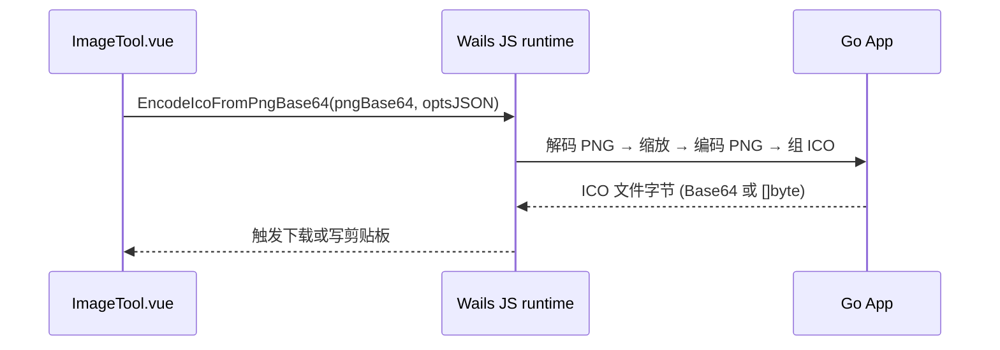

# 使用 Go 实现 ICO 导出（Wails 场景）

本文说明：**可以用 Go 在桌面端生成 ICO**，并与现有 Wails 后端集成；在多数情况下，相比浏览器 `canvas.toBlob('image/png')`，Go 端更容易做到 **更高 zlib 压缩级别**、**调色板量化** 或 **调用外部 PNG 优化工具**，从而缩小体积。

---

## 1. 是否适合用 Go 处理？

| 方面 | 说明 |
|------|------|
| **可行性** | 完全可行。ICO（Windows Vista+）可嵌入 **PNG 位图**，Go 只需按规范拼装 `ICONDIR` + `ICONDIRENTRY` + 多段 PNG 字节即可，逻辑与前端 `icoEncode.js` 一致。 |
| **为何可能更小** | 浏览器编码 PNG 时压缩策略不可控；Go 使用 `png.Encoder{CompressionLevel: png.BestCompression}` 往往比默认更省字节；对图标还可 **降级为 8-bit 调色板** 再编码，体积常明显下降。 |
| **代价** | 需 **前后端约定传输格式**（例如 Base64 或临时文件路径）；首次实现比纯前端多一层绑定与序列化。 |

**结论**：若目标是「尽量小的 `.ico`」，在 Wails 里增加 Go 侧编码是值得的；若只关心功能正确、接受略大文件，维持前端生成也可。

---

## 2. 整体架构（与本仓库一致）

当前仓库根目录已有 Wails：`main.go` 将 `*App` 绑定到前端（`Bind: []interface{}{app}`）。

推荐数据流：



- **输入**：前端已得到「导出用位图」的 **PNG 字节**（例如从 `canvas` 导出或直接读原图），可转为 **Base64 字符串** 传给 Go（避免在 JS 里拼 ICO）。
- **输出**：Go 返回 **ICO 完整字节**（Wails v2 中常再转成 Base64 字符串，便于 `fetch('data:...')` 或 `Blob`）。

---

## 3. ICO 文件结构（PNG 嵌入，简述）

与前端实现相同：

1. **ICONDIR**（6 字节，小端）：`Reserved=0`，`Type=1`（图标），`Count=n`。
2. 对每个 PNG：`ICONDIRENTRY`（16 字节）：宽高（0～255；256 用 `0` 表示）、颜色数、`ColorCount`、平面、`BitCount`、`BytesInRes`、`ImageOffset`。
3. 依次 **拼接** 各 PNG 文件的原始字节（含 PNG 签名与所有 chunk）。

单帧或多帧均可；帧数越多，文件通常越大。

---

## 4. Go 实现要点

### 4.1 依赖

在模块根目录（与 `main.go` 同级）执行：

```bash
go get golang.org/x/image/draw
```

- **`image/png`**：标准库，支持 `BestCompression`。
- **`golang.org/x/image/draw`**：高质量缩放（如 `CatmullRom`）。

### 4.2 从 PNG 字节读取 IHDR 宽高

生成目录项时需要与 PNG 内实际宽高一致（与 `icoEncode.js` 中 `readPngIHDR` 同理）：

```go
package ico

import (
	"encoding/binary"
	"errors"
)

// PngIHDRSize 读取 PNG 的宽高（假定起始为标准 PNG：8 签名 + IHDR chunk）。
func PngIHDRSize(png []byte) (w, h int, err error) {
	const min = 8 + 8 + 13 // signature + chunk len + "IHDR"
	if len(png) < min {
		return 0, 0, errors.New("png too short")
	}
	if string(png[12:16]) != "IHDR" {
		return 0, 0, errors.New("missing IHDR")
	}
	w = int(binary.BigEndian.Uint32(png[16:20]))
	h = int(binary.BigEndian.Uint32(png[20:24]))
	if w <= 0 || h <= 0 {
		return 0, 0, errors.New("invalid dimensions")
	}
	return w, h, nil
}
```

### 4.3 将多段 PNG 封装为 `.ico`

```go
package ico

import (
	"encoding/binary"
	"errors"
)

// EncodeFromPNGBlobs 将多幅独立 PNG 文件字节合并为一个 ICO（Vista+ PNG 图标）。
func EncodeFromPNGBlobs(pngs [][]byte) ([]byte, error) {
	n := len(pngs)
	if n == 0 {
		return nil, errors.New("ico: no images")
	}
	headerSize := 6 + 16*n
	total := headerSize
	for _, p := range pngs {
		total += len(p)
	}
	out := make([]byte, total)
	le := binary.LittleEndian
	le.PutUint16(out[0:2], 0)
	le.PutUint16(out[2:4], 1)
	le.PutUint16(out[4:6], uint16(n))

	dataOff := headerSize
	dir := 6
	for _, png := range pngs {
		w, h, err := PngIHDRSize(png)
		if err != nil {
			return nil, err
		}
		bw, bh := byte(w), byte(h)
		if w >= 256 {
			bw = 0
		}
		if h >= 256 {
			bh = 0
		}
		out[dir] = bw
		out[dir+1] = bh
		out[dir+2] = 0
		out[dir+3] = 0
		le.PutUint16(out[dir+4:dir+6], 1)
		le.PutUint16(out[dir+6:dir+8], 32)
		le.PutUint32(out[dir+8:dir+12], uint32(len(png)))
		le.PutUint32(out[dir+12:dir+16], uint32(dataOff))
		dir += 16
		dataOff += len(png)
	}

	pos := headerSize
	for _, png := range pngs {
		copy(out[pos:], png)
		pos += len(png)
	}
	return out, nil
}
```

### 4.4 解码 → 缩放到正方形 → 以最佳压缩编码 PNG

核心：与前端一样「contain」绘入 `s×s`，但用 **Go PNG 编码器**：

```go
package ico

import (
	"bytes"
	"image"
	"image/draw"
	"image/png"
	"math"

	xdraw "golang.org/x/image/draw"
)

// RasterContainCopy 将 src 按比例缩放到 s×s 画布并居中（与前端 contain 行为一致）。
func RasterContainCopy(src image.Image, s int) *image.NRGBA {
	sw, sh := src.Bounds().Dx(), src.Bounds().Dy()
	if sw <= 0 || sh <= 0 || s <= 0 {
		return image.NewNRGBA(image.Rect(0, 0, s, s))
	}
	scale := math.Min(float64(s)/float64(sw), float64(s)/float64(sh))
	dw := int(math.Max(1, math.Round(float64(sw)*scale)))
	dh := int(math.Max(1, math.Round(float64(sh)*scale)))
	dx := (s - dw) / 2
	dy := (s - dh) / 2

	dst := image.NewNRGBA(image.Rect(0, 0, s, s))
	dstBounds := image.Rect(dx, dy, dx+dw, dy+dh)
	xdraw.CatmullRom.Scale(dst, dstBounds, src, src.Bounds(), draw.Over, nil)
	return dst
}

// EncodePNGBest 使用最高 zlib 压缩级别编码 PNG（通常比浏览器默认更小）。
func EncodePNGBest(img image.Image) ([]byte, error) {
	var buf bytes.Buffer
	enc := png.Encoder{CompressionLevel: png.BestCompression}
	if err := enc.Encode(&buf, img); err != nil {
		return nil, err
	}
	return buf.Bytes(), nil
}
```

> **进一步缩小**：若可接受 256 色，可先将 `*image.NRGBA` 转为 `*image.Paletted`（中位切分或第三方量化），再 `png.Encode`，图标类图像往往再小一截。

### 4.5 从「一幅输入 PNG」生成单帧 ICO（与当前前端默认策略对齐）

```go
package ico

import (
	"bytes"
	"image/png"
)

// BuildSingleFrameICO 解码 pngBytes，按 maxEdge clamp 到 [16,256] 后生成单帧 ICO。
func BuildSingleFrameICO(pngBytes []byte) ([]byte, error) {
	src, err := png.Decode(bytes.NewReader(pngBytes))
	if err != nil {
		return nil, err
	}
	b := src.Bounds()
	maxEdge := b.Dx()
	if b.Dy() > maxEdge {
		maxEdge = b.Dy()
	}
	s := maxEdge
	if s < 16 {
		s = 16
	}
	if s > 256 {
		s = 256
	}
	frame := RasterContainCopy(src, s)
	pngOut, err := EncodePNGBest(frame)
	if err != nil {
		return nil, err
	}
	return EncodeFromPNGBlobs([][]byte{pngOut})
}
```

多帧时：对 `sizes := []int{16, 32, 48, 256}` 循环，每档 `RasterContainCopy` + `EncodePNGBest`，收集 `[][]byte` 后 `EncodeFromPNGBlobs`。

---

## 5. 与 Wails `App` 绑定示例

在 `app.go`（或单独 `ico_service.go`，同一 `package main`）中暴露方法，供前端 `import { ... } from '../wailsjs/go/main/App'` 调用：

```go
import (
	"encoding/base64"
	"strings"
	// "your/module/ico" // 若拆到子包，在此 import
)

// EncodeIcoFromPngBase64 输入整图 PNG 的 Base64（无前缀或带 data URL 前缀均可），返回 ICO 的 Base64。
func (a *App) EncodeIcoFromPngBase64(pngB64 string) (string, error) {
	raw, err := base64.StdEncoding.DecodeString(stripDataURL(pngB64))
	if err != nil {
		return "", err
	}
	icoBytes, err := BuildSingleFrameICO(raw) // 或自定义多帧逻辑
	if err != nil {
		return "", err
	}
	return base64.StdEncoding.EncodeToString(icoBytes), nil
}

func stripDataURL(s string) string {
	const p = "base64,"
	if i := strings.Index(s, p); i >= 0 {
		return s[i+len(p):]
	}
	return strings.TrimPrefix(s, "data:image/png;base64,")
}
```

> 注意：示例中 `stripDataURL` 若仅接受纯 Base64，可省略；若从前端传 `data:image/png;base64,...`，需去掉前缀。更稳妥写法可用 `strings` 判断前缀。

前端伪代码：

```ts
import { EncodeIcoFromPngBase64 } from "../wailsjs/go/main/App";

const pngB64 = dataUrl.split(",")[1]; // 或 canvas.toDataURL
const icoB64 = await EncodeIcoFromPngBase64(pngB64);
const blob = await fetch(`data:image/x-icon;base64,${icoB64}`).then((r) => r.blob());
```

---

## 6. 体积仍偏大时的可选手段

1. **调色板 PNG**：对 `*image.NRGBA` 做 256 色量化再编码，ICO 常显著变小（略损失渐变）。
2. **减少帧数**：保持单帧或与 UI 约定「仅 256×256 一帧」。
3. **外部压缩**：生成 PNG 字节后调用 [oxipng](https://github.com/shssoichiro/oxipng) 等 CLI，`exec.Command` 再读回字节后塞进 ICO（构建与分发需打包二进制或要求本机已安装）。
4. **旧式 BMP+DIB**：部分老字号场景需要，实现复杂且对照片不一定更小，一般不作为首选。

---

## 7. 小结

- **Go 完全可以**承担 ICO 组装与 PNG 重编码，并与现有 Wails `App` 绑定。
- 缩小体积的关键不在「是否 Go」，而在 **压缩级别、颜色数、帧数**；Go 提供了比浏览器更可预测的 **PNG 编码参数** 与 **后续优化流水线**。
- 实现步骤可归纳为：**PNG 解码 → 按档位缩放（draw）→ png.BestCompression 编码 → `EncodeFromPNGBlobs` → 经 Wails 交回前端下载**。

将 `ico` 逻辑放在独立包（例如 `internal/ico`）便于单测与复用； `docs` 仅作设计说明，落地时以 `go test` 与集成测试为准。

---

## 8. 本仓库落地状态（已实现）

| 位置 | 说明 |
|------|------|
| `internal/ico/` | `BuildSingleFrameICO`、`EncodeFromPNGBlobs`、`RasterContainCopy`、`EncodePNGBest`；`go test ./internal/ico/...` |
| `app.go` | `EncodeIcoFromPngBase64(pngB64, sizesJSON)`：`sizesJSON` 为空或 `[]` 为自动单帧；否则为边长 JSON 数组（如 `[16,32,256]`） |
| `frontend/src/tools/ImageTool.vue` | ICO 格式下从 16/32/48/64/128/256 选一，默认 **32×32**；始终传 `sizesJSON`（单元素数组）给 Go，浏览器回退用 `buildIcoFromOutputCanvas(oc, [n])` |
| `frontend/wailsjs/go/main/App.*` | 由 `wails generate module` / `wails build` 自动生成 |

依赖：`go.mod` 中 `golang.org/x/image v0.18.0`（与 `go 1.21` / `toolchain go1.22.2` 兼容）。
