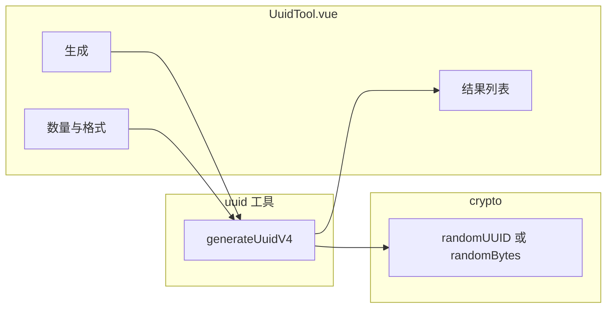

# UUID 生成器功能规划

本文档说明如何在 **DevTools 桌面/前端**（`frontend/`，Vue 3 + Vue Router + vue-i18n）中新增 **UUID 生成器** 工具，作为现有 JSON / Base64 / 时间戳 等工具的扩展。

---

## 1. 业务目标

| 目标 | 说明 |
|------|------|
| **快速生成** | 一键生成符合 RFC 9562（原 RFC 4122）语义的 **UUID v4（随机）**，用于本地开发、测试数据、占位 ID。 |
| **批量与导出** | 支持一次生成多条（如 1～1000），便于压测脚本或批量造数。 |
| **格式可控** | 可选 **标准带连字符**（`8-4-4-4-12`）与 **无连字符**（32 位十六进制）；可选 **大小写**。 |
| **复制友好** | 单条/整批 **复制到剪贴板**；必要时提供 **下载为 `.txt`**。 |
| **离线可用** | 仅使用浏览器 **Web Crypto**（`crypto.randomUUID` 或 `getRandomValues`），不依赖后端。 |
| **产品一致** | 侧栏导航、文档标题（`App.vue`）、中英文文案与现有工具页风格一致。 |

非目标（首轮可不实现）：UUID v1/v6/v7 时间排序、命名空间 UUID v3/v5、在线校验他人 UUID 的完整性（可作为后续迭代）。

---

## 2. 技术方案概览



- **推荐**：优先使用 `crypto.randomUUID()`（返回小写带连字符的 v4），再根据 UI 选项转换为无连字符或大写。
- **降级**：在无 `randomUUID` 的环境（极少见）用 `crypto.getRandomValues(new Uint8Array(16))` 本地拼装 v4（设置版本 `0100`、变体 `10`）。

---

## 3. 需要修改/新增的文件

| 路径 | 动作 |
|------|------|
| `frontend/src/utils/uuid.js` | **新增**：纯函数 `generateUuidV4()`、`formatUuid(raw, options)` |
| `frontend/src/tools/UuidTool.vue` | **新增**：页面与交互 |
| `frontend/src/router/index.js` | **修改**：注册子路由 `/uuid` |
| `frontend/src/shell/ShellLayout.vue` | **修改**：`nav` 增加一项 |
| `frontend/src/locales/zh.json` | **修改**：`tools.uuid.*` |
| `frontend/src/locales/en.json` | **修改**：同上英文 |

可选：`frontend/src/utils/uuid.js` 中单测（若后续接入 Vitest）。

---

## 4. 核心逻辑代码片段

### 4.1 `frontend/src/utils/uuid.js`

```javascript
/**
 * 返回 RFC 9562 UUID v4 的 16 字节（Uint8Array），版本与变体位已设置。
 * 优先 randomUUID 解析；否则用 getRandomValues。
 */
export function uuidV4Bytes() {
  const c = globalThis.crypto;
  if (!c || !c.getRandomValues) {
    throw new Error("Web Crypto missing");
  }
  if (typeof c.randomUUID === "function") {
    const hex = c.randomUUID().replace(/-/g, "");
    const out = new Uint8Array(16);
    for (let i = 0; i < 16; i++) {
      out[i] = parseInt(hex.slice(i * 2, i * 2 + 2), 16);
    }
    return out;
  }
  const b = new Uint8Array(16);
  c.getRandomValues(b);
  b[6] = (b[6] & 0x0f) | 0x40; // version 4
  b[8] = (b[8] & 0x3f) | 0x80; // variant 10
  return b;
}

function bytesToHex(b, upper = false) {
  const map = upper ? "0123456789ABCDEF" : "0123456789abcdef";
  let s = "";
  for (let i = 0; i < b.length; i++) {
    const v = b[i];
    s += map[v >> 4] + map[v & 0xf];
  }
  return s;
}

/**
 * @param {{ hyphen?: boolean; upper?: boolean }} [opts]
 * @returns {string}
 */
export function generateUuidV4(opts = {}) {
  const { hyphen = true, upper = false } = opts;
  const b = uuidV4Bytes();
  const hex = bytesToHex(b, upper);
  if (!hyphen) return hex;
  return [
    hex.slice(0, 8),
    hex.slice(8, 12),
    hex.slice(12, 16),
    hex.slice(16, 20),
    hex.slice(20, 32),
  ].join("-");
}

/**
 * @param {number} count
 * @param {{ hyphen?: boolean; upper?: boolean }} [opts]
 * @returns {string[]}
 */
export function generateManyUuids(count, opts) {
  const n = Math.max(1, Math.min(1000, Math.floor(Number(count)) || 1));
  const out = [];
  for (let i = 0; i < n; i++) out.push(generateUuidV4(opts));
  return out;
}
```

说明：若希望减少“解析 randomUUID 再反解字节”的开销，可直接在 `randomUUID` 分支返回字符串再做 hyphen/upper 变换（更简单，见下）。

**简化版（仅字符串变换，推荐与 `randomUUID` 配合）**：

```javascript
export function generateUuidV4String(opts = {}) {
  const c = globalThis.crypto;
  if (!c?.randomUUID) throw new Error("randomUUID not available");
  let s = c.randomUUID(); // 小写 + 带 hyphen
  if (opts.upper) s = s.toUpperCase();
  if (!opts.hyphen) s = s.replace(/-/g, "");
  return s;
}
```

首轮实现可选用**简化版**；需要严格统一“降级路径与主路径格式一致”时再保留完整字节版。

---

### 4.2 `frontend/src/tools/UuidTool.vue`（结构与片段）

- 使用 `useI18n()`、`copyText`（`../utils/clipboard`），与 `Base64Tool.vue` 一致。
- 状态建议：`count`（1～1000）、`hyphen`、`upperCase`、`items`（`ref([])`）。
- 按钮：**生成**、**复制全部**（`items.join('\n')`）、**清空**。
- 列表：每项旁 **复制** 按钮；可选 `mono` 字体类。

```vue
<script setup>
import { ref, computed } from "vue";
import { useI18n } from "vue-i18n";
import { copyText } from "../utils/clipboard";
import { generateManyUuids } from "../utils/uuid";

const { t } = useI18n();

const count = ref(1);
const hyphen = ref(true);
const upperCase = ref(false);
const items = ref([]);

function runGenerate() {
  items.value = generateManyUuids(count.value, { hyphen: hyphen.value, upper: upperCase.value });
}

async function copyAll() {
  if (!items.value.length) return;
  await copyText(items.value.join("\n"));
}

async function copyOne(line) {
  await copyText(line);
}
</script>
```

模板区域按现有卡片/工具栏样式（参考 `TimestampTool.vue` 或 `Base64Tool.vue`）排版即可。

---

### 4.3 路由 `frontend/src/router/index.js`

```javascript
import UuidTool from "../tools/UuidTool.vue";

// children 数组中增加：
{
  path: "uuid",
  name: "uuid",
  component: UuidTool,
  meta: { titleKey: "tools.uuid.title" },
},
```

如需把 **默认首页** 改为 UUID 页，可改 `redirect` 的 `return "/json"` 为 `return "/uuid"`（通常不必，保持 `/json` 即可）。

---

### 4.4 侧栏 `frontend/src/shell/ShellLayout.vue`

在 `nav` 数组中增加一项（顺序按产品需求，示例放在 `/base64` 后）：

```javascript
const nav = [
  { path: "/image", titleKey: "tools.image.title" },
  // ...
  { path: "/base64", titleKey: "tools.base64.title" },
  { path: "/uuid", titleKey: "tools.uuid.title" },
  { path: "/json", titleKey: "tools.json.title" },
];
```

---

### 4.5 国际化 `frontend/src/locales/zh.json` / `en.json`

在 `tools` 下增加对象（键名与页面 `t('tools.uuid.xxx')` 一致）：

**zh.json 片段：**

```json
"uuid": {
  "title": "UUID 生成器",
  "desc": "生成随机 UUID v4，支持批量与多种输出格式。",
  "generate": "生成",
  "count": "数量",
  "hyphen": "带连字符",
  "upperCase": "大写",
  "copy": "复制",
  "copyAll": "复制全部",
  "clear": "清空",
  "download": "下载为文本",
  "result": "结果"
}
```

**en.json 片段：** 逐项翻译为英文即可。

---

## 5. 交互与边界

- **数量**：限制在 **1～1000**（或 500），避免一次生成过大阻塞 UI。
- **无障碍**：主按钮带 `aria-label`；列表项复制按钮带简短说明。
- **错误**：无 `crypto` 时展示友好提示（WebView 极罕见，可复用 `common` 下 generic 错误文案或新增 `tools.uuid.noCrypto`）。
- **安全**：UUID 仅客户端随机，**不收集、不上传**；与现有离线嵌入策略一致。

---

## 6. 验收清单（建议）

1. 侧栏可进入 UUID 页，窗口标题为 `DevTools — …` 对应语言。
2. 单次/批量生成，格式切换后重新生成结果符合 hyphen/upper 选项。
3. 复制单条、复制全部在 Wails 与浏览器中可用（与现有 `clipboard` 工具行为一致）。
4. 浅色/暗色主题下可读性正常。
5. 切换语言后文案立即更新。

---

## 7. 后续迭代（可选）

- **UUID v7**：需自行实现或引入轻量库；注意 bundle 体积与审计。
- **历史记录**：`sessionStorage` 保存最近 N 条，避免污染 `localStorage`。
- **二维码**：对单条 UUID 生成 QR（若产品需要）。

---

## 8. 小结

通过在 `utils/uuid.js` 封装 v4 生成、新增 `UuidTool.vue` 页面，并补齐 **路由 + 侧栏 + i18n**，即可在不大改架构的前提下完成 **UUID 生成器**；优先采用 **`crypto.randomUUID` + 字符串格式化**，实现简单且满足离线桌面应用需求。
